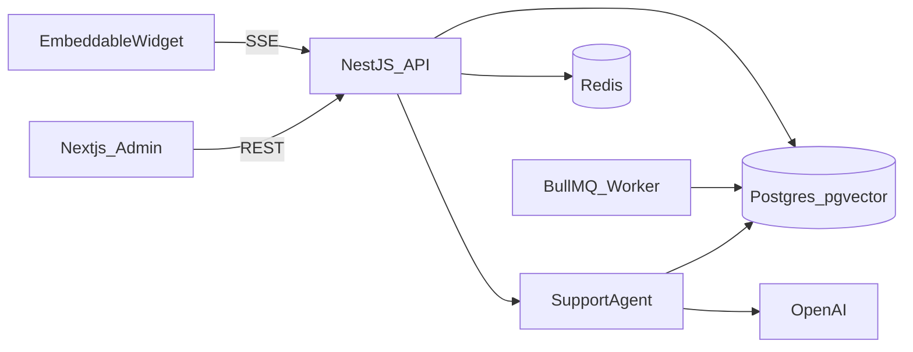

# CX Support Agent

> Production-style AI customer support platform: embeddable chat widget, RAG knowledge base, agent tool-use (order lookup + ticket escalation), admin dashboard, and conversation analytics.

**Portfolio target:** Mid-level Software Engineer (CX AI Solutions)

## Live demo

Deploy with the instructions below, then add your URL here:

- Admin: `https://your-web-url`
- Widget demo: `https://your-web-url/demo`
- API docs: `https://your-api-url/docs`

## What this demonstrates for CX AI roles

- Embeddable web chat widget with **SSE streaming**
- **RAG knowledge base** with async ingestion (BullMQ + pgvector)
- **Agent workflows**: classify intent → retrieve KB → order lookup → ticket escalation
- **Human-in-the-loop** via ticket creation and agent takeover stub
- **Admin dashboard**: documents, conversations, tickets, analytics
- **Eval harness**: `pnpm eval` reports retrieval@3 on seeded FAQ content

## Stack

Next.js · NestJS · Drizzle · Postgres + pgvector · Redis · BullMQ · OpenAI · TypeScript

See [`docs/architecture.md`](docs/architecture.md) and [`docs/adr/0001-stack.md`](docs/adr/0001-stack.md).

## Quickstart

```bash
cp .env.example .env   # add OPENAI_API_KEY
chmod +x scripts/setup.sh
./scripts/setup.sh
```

In separate terminals:

```bash
pnpm dev:api
pnpm dev:worker
pnpm dev:web
```

- Admin UI: http://localhost:3000
- Demo login: `admin@cx-demo.com` / `demo12345`
- Widget demo: http://localhost:3000/demo
- API health: http://localhost:3001/health
- Swagger: http://localhost:3001/docs

## Embed the widget

```html
<script
  src="https://your-web-url/widget.js"
  data-api-url="https://your-api-url"
  data-api-key="your-widget-api-key"
  async
></script>
```

## Repo layout

```
apps/api/       NestJS API + BullMQ worker entry
apps/web/       Next.js admin dashboard
apps/widget/    Embeddable chat widget bundle
packages/ai/    Agent, RAG retriever, tools, eval
packages/db/    Drizzle schema + migrations + seed
packages/shared Zod schemas + shared types
```

## Architecture



## Eval harness

After seeding FAQ content with a valid `OPENAI_API_KEY`:

```bash
pnpm eval
# retrieval@3: 85%+ (15 labeled FAQ questions)
```

## Deployment

See [`docs/DEPLOY.md`](docs/DEPLOY.md) for step-by-step Vercel + Fly.io + Neon + Upstash setup.

| Component | Suggested host |
|---|---|
| Web | Vercel (`apps/web`) |
| API | Fly.io or Railway (`apps/api`) |
| Worker | Same image, `pnpm start:worker` |
| Postgres | Neon (enable pgvector) |
| Redis | Upstash |

Set env vars from `.env.example` in each service. Run migrations against production DB before seeding demo content.

## GitHub profile tips

Pin this repo and update your bio:

> Mid Software Engineer · Building AI-powered customer support (RAG, agents, escalation) · TypeScript · Open to CX AI Solutions roles

Topics: `customer-support`, `rag`, `chatbot`, `typescript`, `nextjs`, `ai-agents`, `pgvector`

## Related work

Earlier Python RAG exploration: [AI-Workspace](https://github.com/ThePeetMan/AI-Workspace)
